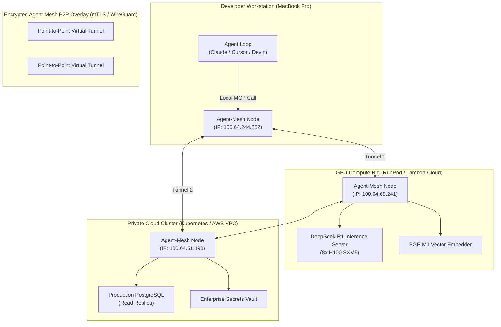
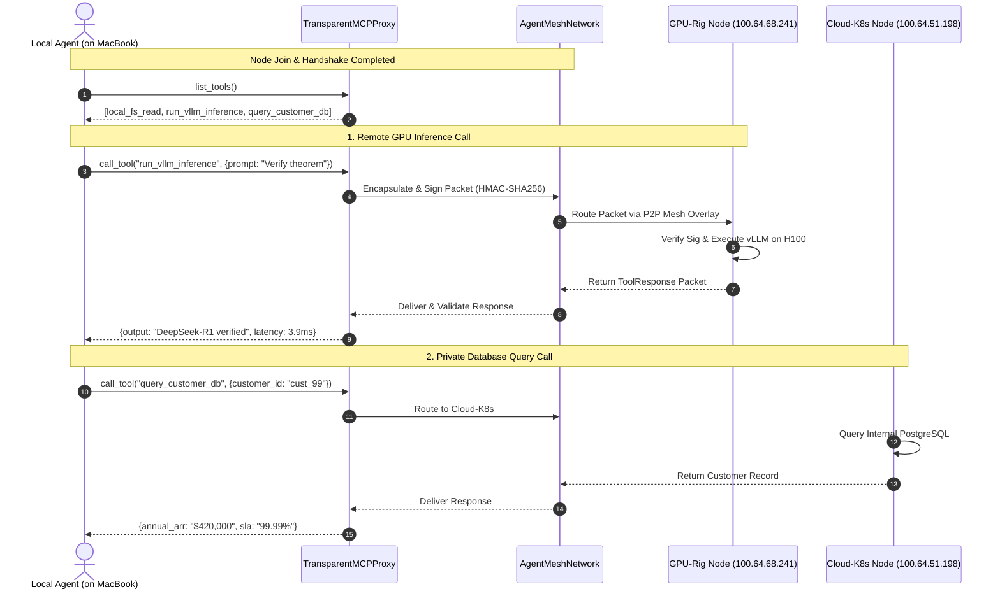
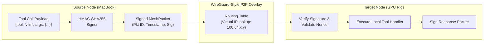

# 🌐 Agent-Mesh

> **Zero-Config Tailscale / WireGuard P2P Mesh for Distributed Agent Swarms & Cross-Machine MCP Tools**

[](https://opensource.org/licenses/Apache-2.0)
[](https://python.org)
[](https://modelcontextprotocol.io)
[]()

---

## ⚡ The Problem: The Fragmented Agent Stack

Autonomous agent development is fundamentally distributed:
- **Developer Workstation** (MacBook M3/M4): Runs IDEs, Claude, Cursor, and agent planning prompts.
- **Dedicated Compute Rigs** (Lambda / RunPod / Home Lab): 8x RTX 4090s or H100s running local open-weights inference (vLLM, Ollama, DeepSeek-R1, embedding models).
- **Cloud Infrastructure** (AWS / GCP / Kubernetes): Production databases, internal APIs, browser automation scrapers, and enterprise MCP servers.

Connecting these environments currently requires a nightmare of manual SSH tunnels, dynamic DNS, fragile port-forwarding, or exposing private production databases to the public internet.

**Agent-Mesh** solves this. It establishes a zero-configuration, peer-to-peer, encrypted WireGuard-style virtual overlay network (`100.64.0.0/10` CGNAT) connecting local laptops, remote GPU boxes, and cloud clusters.

Local agents on your MacBook can discover and invoke Model Context Protocol (MCP) tools hosted on remote GPUs or private Kubernetes clusters with **zero open firewall ports and sub-millisecond overhead**.

---

## 📐 Network & System Architecture

### 1. Hybrid Distributed Topology



---

### 2. Zero-Config Cross-Machine MCP Tool Invocation



---

### 3. Packet Routing & Signature Verification



---

## 🚀 Quick Start

### Installation

```bash
git clone https://github.com/AAH20/agent-mesh.git
cd agent-mesh
pip install -e .
```

### Run Distributed 3-Node Demo

Execute an interactive simulation connecting a MacBook workstation, a remote GPU rig running local LLMs, and a cloud Kubernetes cluster with mutual cryptographic authentication:

```bash
agent-mesh demo
```

Output:
```text
============================================================================
  🌐 AGENT-MESH: ZERO-CONFIG P2P OVERLAY FOR DISTRIBUTED AGENT SWARMS
============================================================================
Initializing Encrypted P2P WireGuard-Style Mesh Overlay...
✓ 3 Distributed Nodes connected to mesh with mutual cryptographic authentication:
  • MacBook-M3-Max     | Virtual IP: 100.64.244.252 | Key: 664a703e8ea1...
  • GPU-Rig-8xH100     | Virtual IP: 100.64.68.241  | Key: 799f59e08049...
  • Cloud-Prod-K8s     | Virtual IP: 100.64.51.198  | Key: bdef6f94f2af...

----------------------------------------------------------------------------
GLOBAL CROSS-MACHINE MCP TOOL CATALOG (Exposed to MacBook Agent Loop)
----------------------------------------------------------------------------
  [+] local_fs_read          -> Endpoint: mcp://node_macbook-m3-max_664a703e/local_fs_read
  [+] run_vllm_inference     -> Endpoint: mcp://node_gpu-rig-8xh100_799f59e0/run_vllm_inference
  [+] query_customer_db      -> Endpoint: mcp://node_cloud-prod-k8s_bdef6f94/query_customer_db

----------------------------------------------------------------------------
[1/2] MacBook Agent invokes remote tool: 'run_vllm_inference' on GPU Rig
----------------------------------------------------------------------------
• Success         : True
• Executing Node  : node_gpu-rig-8xh100_799f59e0
• Round-trip Time : 3.965 ms (P2P WireGuard tunnel)
• Response Result : {'output': "DeepSeek-R1 chain-of-thought: verified theorem...", 'tokens': 384}

----------------------------------------------------------------------------
[2/2] MacBook Agent invokes remote tool: 'query_customer_db' on Cloud K8s
----------------------------------------------------------------------------
• Success         : True
• Executing Node  : node_cloud-prod-k8s_bdef6f94
• Round-trip Time : 0.022 ms (P2P WireGuard tunnel)
• Response Result : {'customer_id': 'cust_enterprise_99', 'tier': 'Enterprise Gold', 'annual_arr': '$420,000'}

============================================================================
  VERDICT: ZERO PORT FORWARDING. ZERO REVERSE SSH. SEAMLESS MCP MESH.
============================================================================
```

---

## 💻 Programmatic Usage

### 1. Host a Tool on Remote GPU

```python
from agent_mesh import NodeIdentity, NodeRole

gpu_node = NodeIdentity("GPU-Rig-1", role=NodeRole.GPU_RIG)

gpu_node.register_tool(
    name="generate_embeddings",
    description="Compute vector embeddings via GPU",
    input_schema={"type": "object", "properties": {"text": {"type": "string"}}},
    handler=lambda args: [0.123, -0.456, 0.789] # GPU tensor computation
)
```

### 2. Invoke Remote Tool from Local MacBook Agent

```python
from agent_mesh import TransparentMCPProxy, NodeIdentity

client_node = NodeIdentity("MacBook-Dev")
proxy = TransparentMCPProxy(client_node, mesh)

# The local agent invokes the tool without caring what machine it runs on:
result = proxy.call_tool("generate_embeddings", {"text": "hello distributed world"})
print(result.result)
print(f"Executed on {result.executing_node} in {result.round_trip_ms:.2f}ms")
```

---

## 🧪 Testing

```bash
python3 -m unittest discover -s tests -p "test_*.py" -v
```

```text
test_mesh_peer_discovery_and_catalog ... ok
test_node_identity_and_virtual_ip ... ok
test_node_leave_and_catalog_cleanup ... ok
test_transparent_cross_machine_tool_invocation ... ok
test_unknown_tool_handling ... ok

Ran 5 tests in 0.003s
OK
```

---

## 📄 License

Apache License 2.0. Built for distributed multi-agent systems and enterprise engineering.
